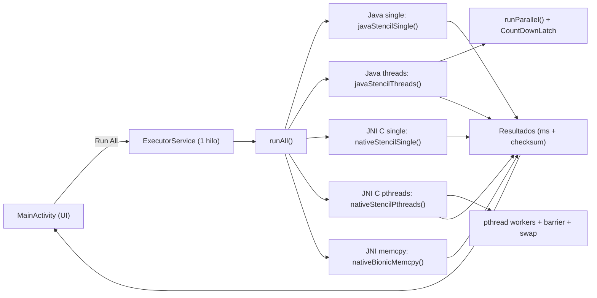
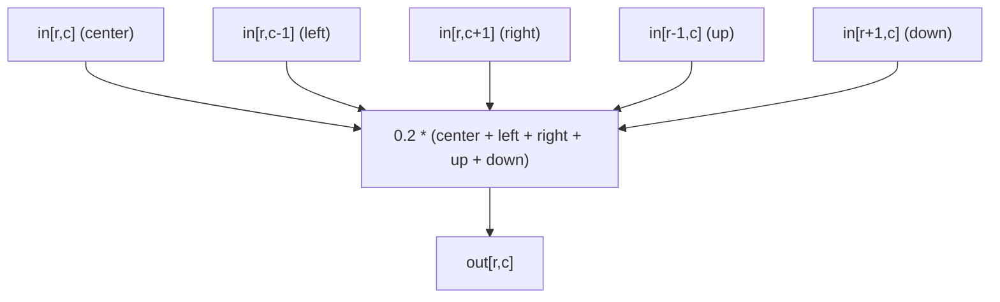

# 📱 MatrixBench (Android) — Java vs JNI (C) Performance Benchmark

### Stencil 5-point • Single-thread vs Multi-thread • JNI + pthreads • memcpy (bionic)

Este repositorio contiene una app Android escrita en **Java + C (JNI)** cuyo objetivo es **comparar rendimiento** entre:

* **Java single-thread**
* **Java multi-thread (ExecutorService + CountDownLatch)**
* **C single-thread (JNI)**
* **C multi-thread (JNI + pthreads + barreras)**
* **memcpy bandwidth (bionic libc)**

El cálculo principal es un **stencil de 5 puntos** (kernel típico de HPC / cómputo numérico) sobre una matriz `N×N`.

> ✅ Proyecto orientado a **benchmarking didáctico y reproducible**
> ⚠️ No pretende ser un benchmark “científico” perfecto (temperatura, governor, afinidad CPU, etc. influyen muchísimo)

---

## ✨ Qué mide exactamente

### Kernel principal: Stencil 5-point

Para cada celda interior de la matriz:

```
out[i] = 0.2 * (center + left + right + up + down)
```

Esto se ejecuta repetidamente durante `iters` iteraciones, haciendo *ping-pong* entre buffers `in/out`.

---

## 🧪 Modos de ejecución disponibles

La app ejecuta 5 pruebas consecutivas:

1. **Java single**
2. **Java threads** (divide filas en chunks y sincroniza con `CountDownLatch`)
3. **JNI C single**
4. **JNI C pthreads** (divide filas en chunks y sincroniza con barreras)
5. **JNI bionic memcpy** (mide ancho de banda de memoria usando `memcpy`)

> 🧠 Importante: Las pruebas **1..4** ejecutan el **mismo kernel** de stencil.
> La prueba **5** NO ejecuta stencil: solo mide memoria con `memcpy()`.

---

## 🎛️ Parámetros de entrada (UI)

La app permite configurar:

### ✅ Tamaño de matriz `N`

Controlado por un `SeekBar`:

* `N = 256 * (idx + 2)`
* Rango aproximado: **512 .. 4096**
* Valor por defecto: **1024**

### ✅ Iteraciones `iters`

Desde el `EditText`:

* Si falla el parseo → valor por defecto **30**

### ✅ Número de hilos `threads`

Desde el `EditText`:

* Si falla el parseo → por defecto `availableProcessors()`

> 💡 Consejo práctico: para ver diferencias reales, usa `N >= 2048`, `iters >= 20` y ejecuta en **Release**.

---

## ▶️ Cómo ejecutar

### Requisitos

* Android Studio
* Android SDK
* Android NDK (para el módulo nativo `matrixbench`)
* Dispositivo físico recomendado (en emulador los resultados se distorsionan)

### Ejecutar

1. Abre el proyecto con Android Studio
2. Compila y ejecuta en un dispositivo
3. Ajusta `N`, `iters`, `threads`
4. Pulsa **Run All**

---

## 📦 Interfaz JNI (NativeBridge)

La clase `NativeBridge` carga la librería nativa y expone 3 funciones:

```java
System.loadLibrary("matrixbench");
```

Firmas nativas:

* `nativeStencilSingle(int n, int iters)`
* `nativeStencilPthreads(int n, int iters, int threads)`
* `nativeBionicMemcpy(int n, int iters)`

📌 **Formato de retorno** (en las 3):

* `long[2]`

  * `[0] = tiempo en nanosegundos`
  * `[1] = checksum codificado como bits de double (Double.longBitsToDouble(...))`

---

## 🧾 Salida esperada

Cada prueba imprime algo similar a:

* `X ms total`
* `Y ms/iter`
* `checksum = ...`

Ejemplo conceptual:

```
1) Java single -> 1200.000 ms total (40.000 ms/iter), checksum=123.456789
2) Java threads -> 700.000 ms total (23.333 ms/iter), checksum=123.456789
3) JNI C single -> 900.000 ms total (30.000 ms/iter), checksum=123.456789
4) JNI C pthreads -> 500.000 ms total (16.666 ms/iter), checksum=123.456789
5) JNI bionic memcpy -> 200.000 ms total (6.666 ms/iter), checksum=123.456789
```

> ✅ El checksum sirve para evitar optimizaciones agresivas y confirmar que **las ejecuciones son comparables**.

---

## 🧠 Detalles de implementación (importantes)

### 1) Warm-up para JIT / caches

En **Java** y en **C** se hace una iteración previa (“warm-up”) antes de cronometrar.

Esto reduce variabilidad por:

* compilación JIT en Java
* calentamiento de caches y TLBs

---

### 2) Evitar “Dead Code Elimination”

Para impedir que el compilador elimine trabajo “inútil”:

* En Java se usa un `volatile` sink:

  ```java
  private static volatile double JAVA_SINK = 0.0;
  ```

* En C se usa un sink global:

  ```c
  static volatile double G_SINK = 0.0;
  ```

---

### 3) Checksum por muestreo (más barato)

No se suma el vector completo (sería costoso), sino que se muestrea cada `step`:

* Java:

  ```java
  int step = Math.max(1, a.length / 8192);
  ```

* C:

  ```c
  int step = len / 8192;
  if (step < 1) step = 1;
  ```

---

## 🧵 Paralelismo

### Java multi-thread

* Divide las filas internas en `chunks`
* Usa un pool con `threads`
* Sincroniza con `CountDownLatch`

Ventajas:

* sencillo y portable
* buena demostración de paralelismo en Android

Limitaciones:

* overhead por scheduling/Java threads
* posible contención en arrays grandes

---

### C multi-thread (pthreads)

* Divide filas internas en `chunks`
* Usa `pthread_create`
* Sincroniza con una **barrera manual**
* Un solo hilo (`tid==0`) realiza el swap de buffers

Ventajas:

* menor overhead que Java en algunos dispositivos
* control fino del paralelismo

Limitaciones:

* sincronización con barreras puede costar
* depende del scheduler / afinidad / microarquitectura

---

## 📌 Diagrama conceptual (flujo completo)



---

## 📌 Diagrama conceptual (stencil kernel)



---

## 📂 Estructura del proyecto (mínima)

* `MainActivity.java` → UI + ejecución secuencial de pruebas + kernels Java
* `NativeBridge.java` → puente JNI (`System.loadLibrary("matrixbench")`)
* `matrixbench.c` → implementación nativa:

  * stencil single-thread
  * stencil pthreads
  * memcpy bandwidth (bionic)
* `AndroidManifest.xml` → Activity launcher

---

## ⚡ Consejos para medidas más estables

* Ejecuta en **Release**
* Prueba con el móvil “frío” (sin calentamiento previo)
* Evita cargar otras apps en segundo plano
* Repite 3–5 veces y usa la mediana
* Activa modo avión si quieres máxima estabilidad
* Si quieres rigor: usa **AndroidX Benchmark** y fija condiciones térmicas

---

## 🧩 Extensiones recomendadas (Roadmap)

* [ ] Añadir **NEON** (ARM SIMD) para comparar vectorización
* [ ] Afinidad CPU (pinning) en pthreads
* [ ] Medición de **energía** (perfetto / batterystats)
* [ ] Soporte para **16KB page size** y flags de linker en NDK
* [ ] Report exportable (CSV/JSON)

---

## ⚠️ Disclaimer

Los resultados varían mucho entre dispositivos por:

* microarquitectura (ARM big.LITTLE, caches, memoria)
* frecuencia dinámica (DVFS)
* temperatura y throttling
* scheduler de Android
* versión del runtime y optimizaciones

Este proyecto está pensado para **aprender** y comparar de forma razonable, no como “benchmark definitivo”.

---
